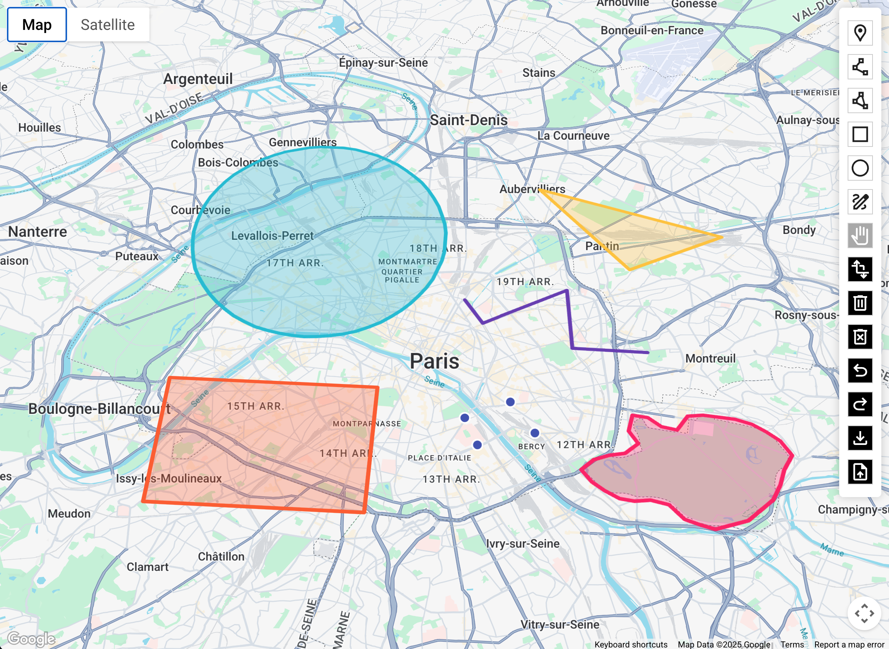

# Basic Terra Draw with Google Maps API Sample

This sample demonstrates a basic implementation of Terra Draw with the Google Maps JavaScript API. It includes various drawing modes such as Point, LineString, Polygon, Rectangle, Circle, and Freehand.

# Google Maps JavaScript Sample

## map-drawing-terradraw

The map-drawing-terradraw sample demonstrates how to use Terra Draw with the Google Maps JavaScript API to draw on a map.

Follow these instructions to set up and run map-drawing-terradraw sample on your local computer.

## Setup

### Before starting run:

`$npm i`

### Run an example on a local web server

First `cd` to the folder for the sample to run, then:

`$npm start`

### Build an individual example

From `samples/`:

`$npm run build --workspace=map-drawing-terradraw/`

### Build all of the examples.

From `samples/`:
`$npm run build-all`

## Feedback

For feedback related to this sample, please open a new issue on
[GitHub](https://github.com/googlemaps-samples/js-api-samples/issues).
